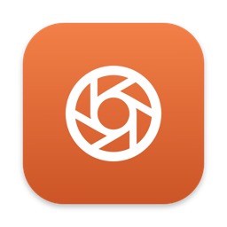
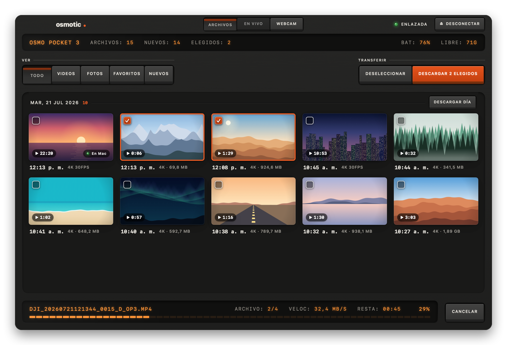
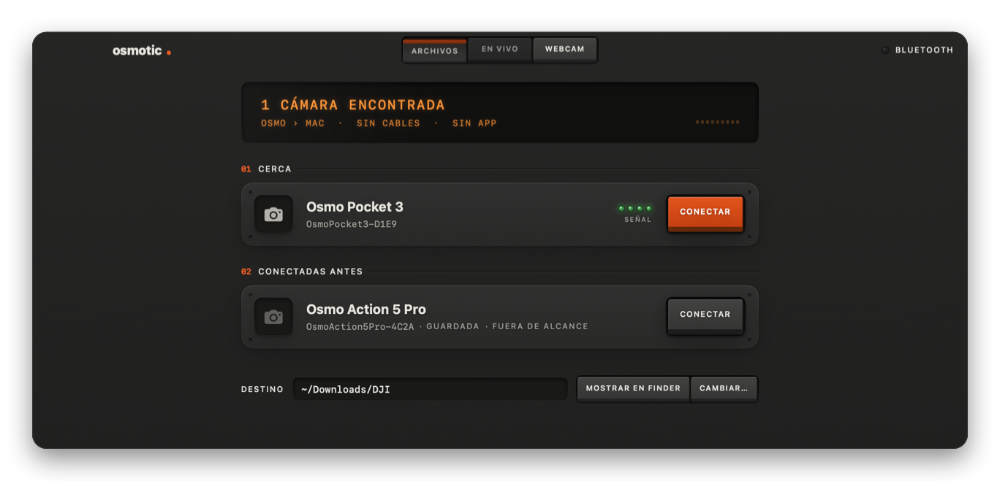
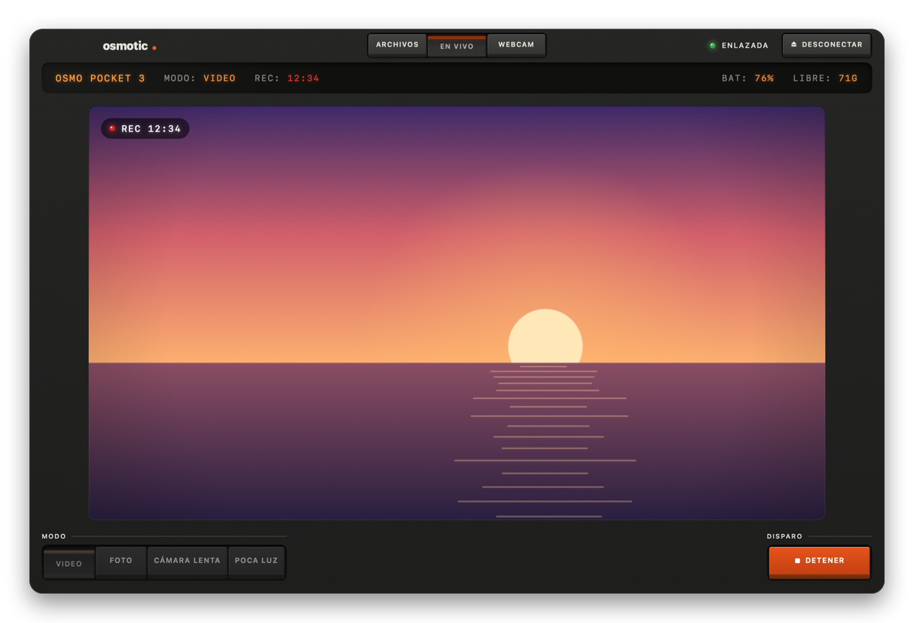
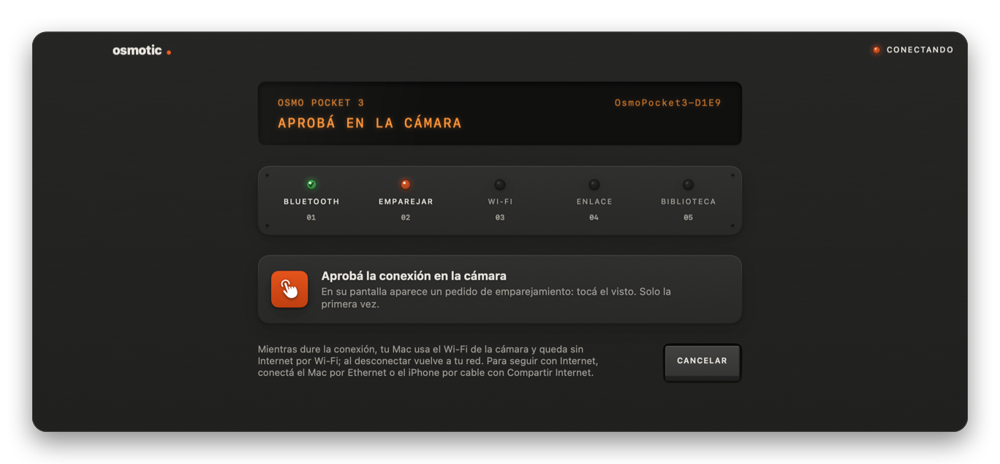
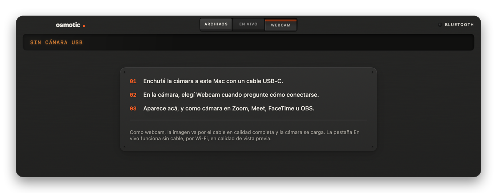
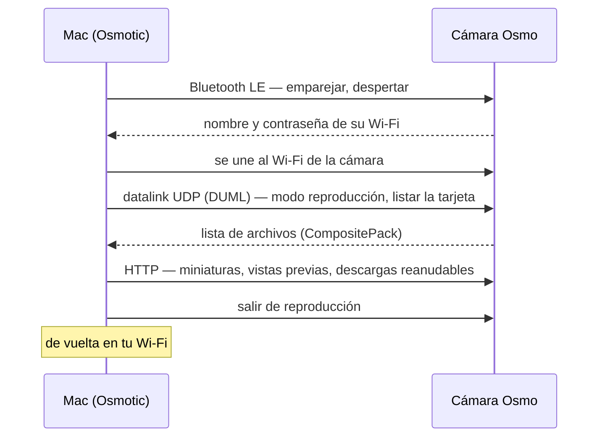

<div align="center">



# Osmotic

**Tu cámara DJI Osmo, en tu Mac. Sin cables, sin la app del teléfono, sin cuentas.**

Bajá tus videos por Wi-Fi, controlá la cámara y mirala en vivo, o usala como webcam por USB — en una app nativa de macOS que parece un equipo de verdad.

[](https://github.com/smithplus/Osmotic/releases/latest)


[](https://github.com/smithplus/Osmotic/actions/workflows/ci.yml)
[](LICENSE)

[English](README.md) · Español

<br>



</div>

## Hecha sobre el trabajo de otros

Osmotic existe porque otras personas hicieron primero la parte difícil. Es un port nativo para macOS de **[Osmosis](https://github.com/KonradIT/osmosis)**, de **Konrad Iturbe**: la app de Android que hizo la ingeniería inversa de cómo las cámaras Osmo de DJI entregan sus archivos por Wi-Fi. El emparejamiento, el protocolo DUML y el decodificador de la lista de archivos son un port a Swift de su trabajo, verificado byte a byte contra sus capturas.

El control de la cámara y la vista en vivo siguen a **[Kaze for DJI](https://github.com/brianmerchant/Kaze-for-DJI)**, de **Brian Merchant**, con notas de **[OpenPocketCine](https://github.com/erik-sutton95/OpenPocketCine)**. Debajo de todo hay años de investigación del protocolo de los [DJI OGs](https://github.com/o-gs) y muchos más — ver [Créditos](#créditos). Gracias.

## Qué hace

<table>
<tr>
<td width="50%" valign="top">

### Archivos

La tarjeta de la cámara, por su propio Wi-Fi. Miniaturas por día, filtros de videos, fotos, favoritos y nuevos. **Descargar nuevos** baja todo lo que todavía no está en tu Mac; las descargas se reanudan si se corta la conexión y nunca pisan nada.

</td>
<td width="50%" valign="top">

### En vivo

Empezá y pará de grabar, sacá fotos, cambiá entre Video, Foto, Cámara lenta y Poca luz, y mirá la imagen de la cámara en vivo — todo por Wi-Fi. Al volver a Archivos, lo que grabaste ya aparece.

</td>
</tr>
<tr>
<td valign="top"></td>
<td valign="top"></td>
</tr>
<tr>
<td valign="top">

### Conectar con un clic

El Mac encuentra la cámara por Bluetooth, le pide la contraseña de su Wi-Fi, se une a su red y la pone en modo reproducción. Cinco luces muestran en qué paso va. Al desconectar, la cámara vuelve a la normalidad y el Mac vuelve a tu Wi-Fi.

</td>
<td valign="top">

### Webcam

Enchufá la cámara por USB-C y elegí Webcam en ella: la imagen aparece en la pestaña Webcam — y en Zoom, Meet, FaceTime u OBS, aunque Osmotic esté cerrada.

</td>
</tr>
<tr>
<td valign="top"></td>
<td valign="top"></td>
</tr>
</table>

### Y los detalles

- **Todo queda donde lo esperás:** `~/Downloads/DJI` (Descargas), una carpeta por día, y cada archivo con la fecha y hora en que se grabó, para que Finder y tu editor lo ordenen bien.
- **Nada dos veces.** Un clip que ya está en tu Mac se saltea, nunca se reemplaza; uno a medio bajar sigue donde quedó — también los de más de 4 GB.
- **Vista previa liviana.** La barra espaciadora abre una vista previa con el proxy `.LRF` de la cámara, no el 4K completo.
- **Los extras, si los querés:** el RAW `.DNG` junto a las fotos y el `.WAV` de respaldo junto a los clips.
- **Todo con teclado:** flechas, ⇧ para extender, espacio para la vista previa, ⌘D y ⇧⌘D para descargar.
- **Se actualiza sola** desde las releases de GitHub, solo después de verificar la firma.
- **En inglés y en español**, según el idioma del Mac. Etiquetas de VoiceOver, Reducir movimiento y un look oscuro de equipo de audio.

## Instalar

1. **[Bajá el último `Osmotic-x.y.z.dmg`](https://github.com/smithplus/Osmotic/releases/latest)**, abrilo y arrastrá **Osmotic** a **Aplicaciones**.
2. Abrí Osmotic. La primera vez, macOS dice que no pudo verificar la app: esta build todavía no está notarizada por Apple (el proyecto no tiene cuenta paga de Apple Developer). Andá a **Ajustes del Sistema › Privacidad y seguridad**, bajá hasta el final y hacé clic en **Abrir igualmente**, junto al aviso de Osmotic.
3. Prendé la cámara y hacé clic en **Conectar**. La primera vez, aprobá el emparejamiento en la pantalla de la cámara.

Las versiones siguientes se instalan solas (**Osmotic › Buscar actualizaciones…**).

**Requisitos:** macOS 15 Sequoia o posterior, Apple silicon o Intel, Bluetooth y Wi-Fi.

### Permisos que pide macOS

| Permiso | Para qué |
|---|---|
| Bluetooth | Encontrar la cámara y emparejarla |
| Ubicación | macOS solo les dice el nombre de tu red Wi-Fi a las apps con este permiso; Osmotic lo usa para volver a tu red después. Nunca se lee ni se guarda tu ubicación. |
| Red local | Hablar con la cámara en `192.168.2.1` |
| Carpeta Descargas | Guardar en `~/Downloads/DJI` |
| Cámara | Mostrar la imagen en la pestaña Webcam (se pide solo cuando hay una cámara enchufada) |
| Notificaciones | Avisarte cuando termina una descarga |

Nada sale de tu Mac: sin analíticas, sin cuentas, sin servidores más allá de la cámara — y GitHub, para buscar actualizaciones. Ver [SECURITY.md](SECURITY.md).

## Cámaras

| Cámara | Archivos | En vivo | Probada con Osmotic |
|---|:-:|:-:|---|
| **Osmo Pocket 3** | ✅ | ✅ | Sí — conectar, listar, descargar, grabar, modos, vista en vivo |
| Osmo Pocket 4 / 4 Pro | ✅ | ✅ | Todavía no — mismo protocolo, verificada en Osmosis |
| Osmo Action 4 / 5 Pro / 6 | ✅ | — | Todavía no — verificada en Osmosis |
| Osmo Nano | ✅ | — | Todavía no — verificada en Osmosis |

Si probás una de las que faltan, un [reporte](https://github.com/smithplus/Osmotic/issues) con el registro técnico (**Ventana › Registro técnico**, ⌥⌘L) ayuda muchísimo.

## Cómo funciona



Mientras está conectado, el Mac usa el Wi-Fi de la cámara, así que **no tiene Internet por Wi-Fi**; con Ethernet o el iPhone compartido por USB seguís en línea. Las notas del protocolo están en [docs/PROTOCOL.md](docs/PROTOCOL.md) y [docs/CONTROL.md](docs/CONTROL.md).

## Preguntas

**¿Qué pasa si mando a descargar el mismo clip dos veces?** Se saltea. Osmotic nunca reemplaza un archivo de tu carpeta; uno sin terminar sigue desde donde quedó.

**¿Borra algo de la cámara?** No. Solo lee.

**Algo no funciona.** Abrí **Ventana › Registro técnico** (⌥⌘L) y adjuntá el archivo en un [issue](https://github.com/smithplus/Osmotic/issues). El registro no incluye tu contraseña ni el nombre de tu red Wi-Fi.

## Compilar

Xcode 26 (Swift 6.2 o más).

```bash
git clone https://github.com/smithplus/Osmotic.git && cd Osmotic
swift test                     # 83 tests: protocolo, decodificador, descargas, una Pocket 3 simulada
scripts/package_app.sh         # build/Osmotic.app
open build/Osmotic.app
```

- `Sources/OsmoticCore` — el protocolo, sin interfaz: tramas BLE, emparejamiento, datalink UDP, decodificador de la lista, descargas HTTP, control de captura y reensamblado de la vista en vivo.
- `Sources/Osmotic` — la app SwiftUI (CoreBluetooth, CoreWLAN, AVFoundation).
- `Tests` — el decodificador contra **14 capturas reales** del proyecto Osmosis, una cámara simulada por UDP, un servidor HTTP que falla a propósito y fuzzing de todo lo que llega de la red.

Colaboradores y agentes de IA: empezá por [CONTRIBUTING.md](CONTRIBUTING.md) y [CLAUDE.md](CLAUDE.md) (también `AGENTS.md`). Releases: `scripts/release.sh X.Y.Z`.

## Créditos

**Código en el que se basa**
- [Osmosis](https://github.com/KonradIT/osmosis), de Konrad Iturbe — el protocolo y el decodificador de la lista de archivos de los que esta app es un port (MIT).
- [Kaze for DJI](https://github.com/brianmerchant/Kaze-for-DJI), de Brian Merchant — control de captura y vista en vivo, adaptados (MIT).
- [OpenPocketCine](https://github.com/erik-sutton95/OpenPocketCine), de erik-sutton95 — notas de vista en vivo y control (Apache-2.0; re-implementado a partir de su documentación).

**Investigación del protocolo** — los [DJI OGs](https://github.com/o-gs), [dji-remote](https://github.com/dimadesu/dji-remote), [osmo-download](https://github.com/SemiConscious/osmo-download), [DJI-Wifi-Connect](https://github.com/sniffingpickles/DJI-Wifi-Connect), [lib-osmo-ble](https://github.com/yigitkonur/lib-osmo-ble), [dji_protocol](https://github.com/samuelsadok/dji_protocol) y [reverse-engineering-dji](https://github.com/xaionaro/reverse-engineering-dji).

**Los testers de Osmosis**, cuyas capturas también prueban esta app — [Rhoenschrat](https://www.rhoenschrat.de/), [Juan Irache](https://github.com/JuanIrache), [GetHypoxic](https://gethypoxic.com/) y [Ave](https://github.com/aveao).

La misma lista está en la app: **Ajustes › Créditos**.

## Licencia

[MIT](LICENSE). Osmotic es un proyecto independiente, **sin afiliación con DJI ni respaldo de DJI**. "DJI" y "Osmo" son marcas de sus dueños. Las capturas muestran datos de demostración.
