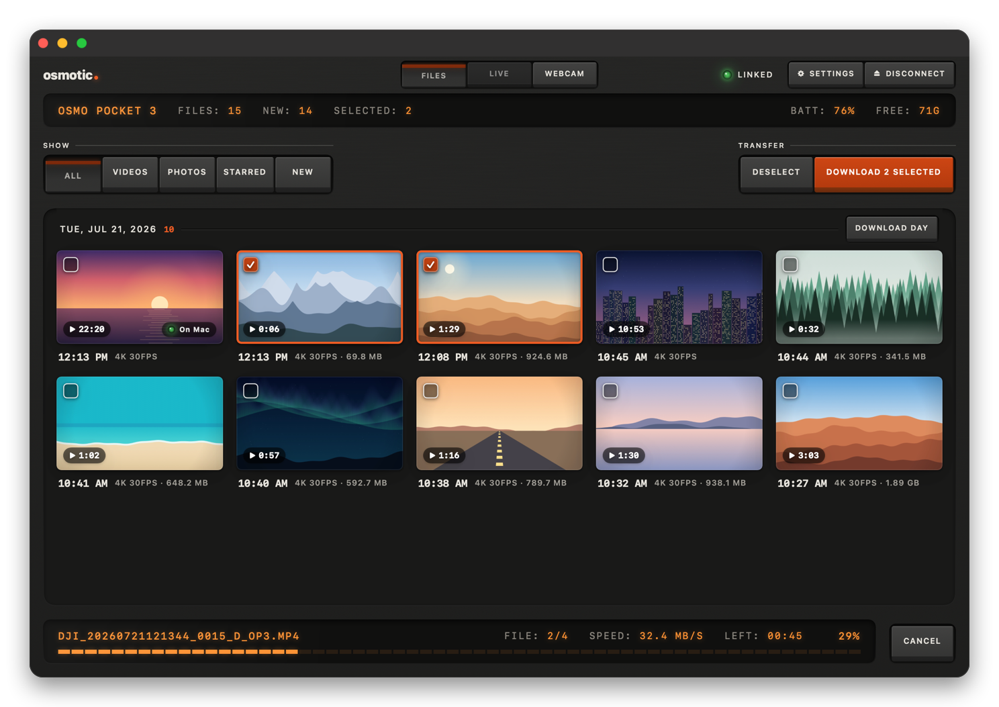
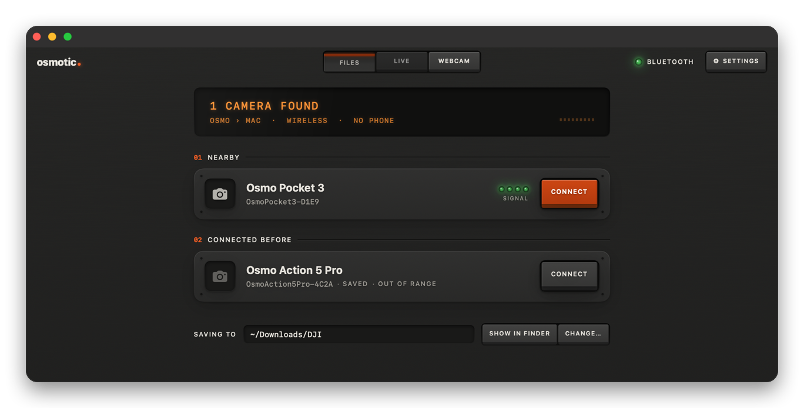
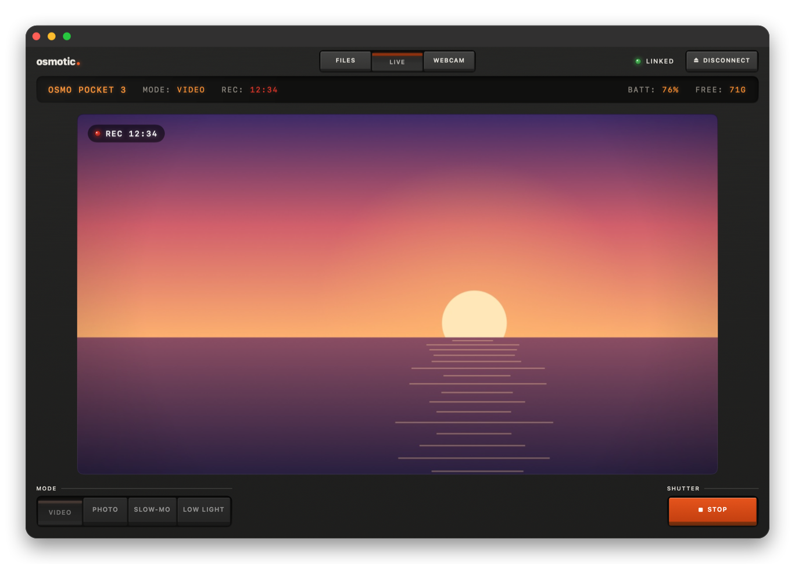
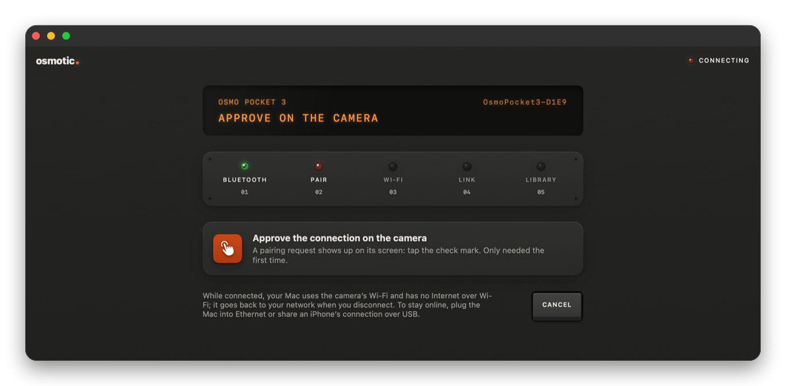
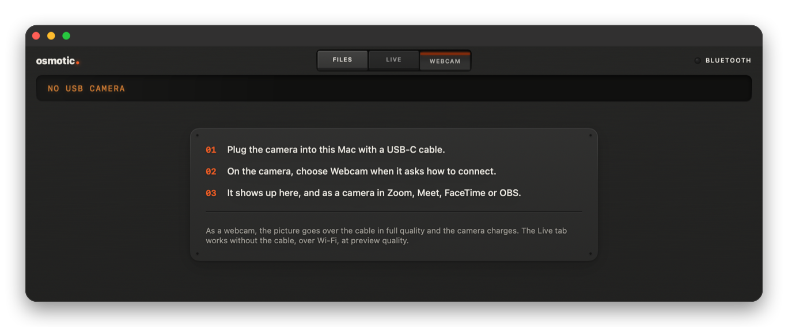
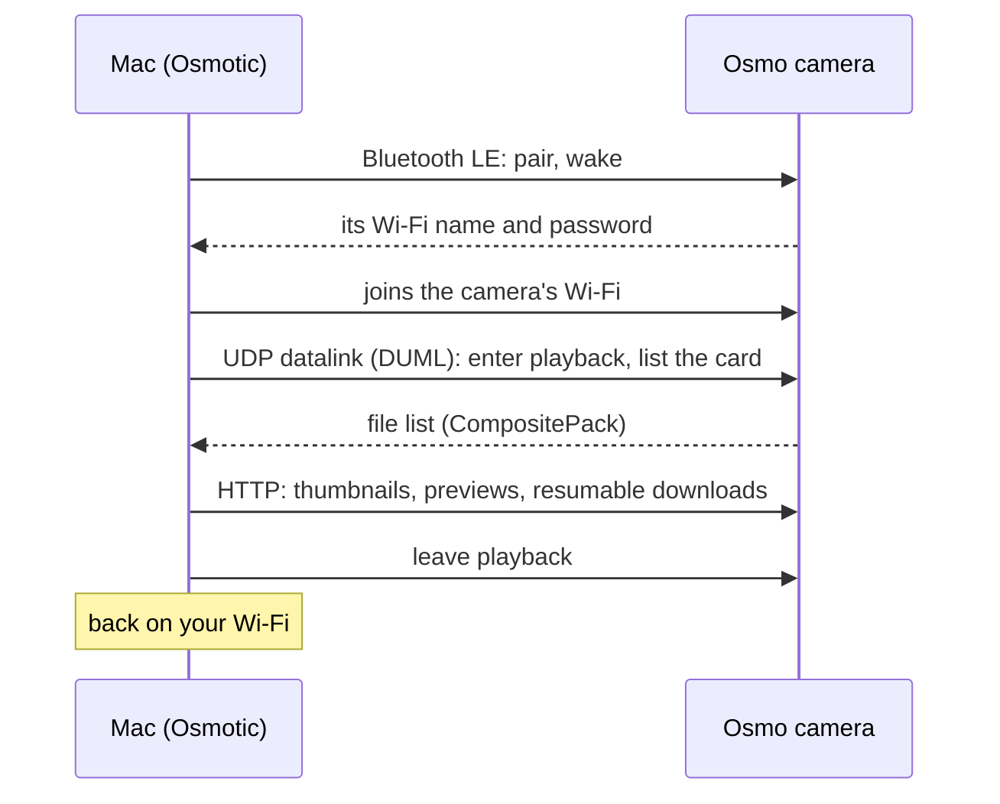

<div align="center">


# Osmotic

**Your DJI Osmo camera, on your Mac. No cables, no phone app, no account.**

Download your footage over Wi-Fi, control the camera and see it live, or use it as a webcam over USB. A native macOS app that looks like a piece of gear.

[](https://github.com/smithplus/Osmotic/releases/latest)

**[smithplus.github.io/Osmotic](https://smithplus.github.io/Osmotic/)**


[](https://github.com/smithplus/Osmotic/actions/workflows/ci.yml)
[](LICENSE)

<br>



</div>

## Built on the work of others

Osmotic exists because other people did the hard part first. It is a native macOS port of **[Osmosis](https://github.com/KonradIT/osmosis)** by **Konrad Iturbe**, the Android app that reverse-engineered how DJI's Osmo cameras hand their files over Wi-Fi. The pairing flow, the DUML protocol and the decoder for the camera's file list are a Swift port of his work, and are checked byte for byte against his captures.

Camera control and the live view follow **[Kaze for DJI](https://github.com/brianmerchant/Kaze-for-DJI)** by **Brian Merchant**, with notes from **[OpenPocketCine](https://github.com/erik-sutton95/OpenPocketCine)**. Underneath all of it is years of protocol research by the [DJI OGs](https://github.com/o-gs) and many others (see [Credits](#credits)). Thank you.

## What it does

DJI's own app sends footage wirelessly to a phone only; to get it onto a computer it's a cable or a card reader. Osmotic lets the Mac talk to the camera directly, at about 33 MB/s with a Pocket 3.

<table>
<tr>
<td width="50%" valign="top">

### Files

The camera's card, over its own Wi-Fi. Thumbnails by day, filters for videos, photos, starred and new. **Download New** takes everything that isn't on your Mac yet; downloads resume if the link drops and never overwrite anything.

</td>
<td width="50%" valign="top">

### Live

Start and stop recording, take photos, switch between Video, Photo, Slow-mo and Low Light, and watch the camera's picture live, all over Wi-Fi. Back in Files, what you just shot is already listed.

</td>
</tr>
<tr>
<td valign="top"></td>
<td valign="top"></td>
</tr>
<tr>
<td valign="top">

### Connect in one click

The Mac finds the camera over Bluetooth, gets its Wi-Fi password from it, joins its network and puts it in playback mode. Five lights show where it is. When you disconnect, the camera goes back to normal and your Mac goes back to your Wi-Fi.

</td>
<td valign="top">

### Webcam

Plug the camera in with USB-C and choose Webcam on it: the picture shows up in the Webcam tab, and in Zoom, Meet, FaceTime or OBS even with Osmotic closed.

</td>
</tr>
<tr>
<td valign="top"></td>
<td valign="top"></td>
</tr>
</table>

### And the details

- **Everything lands where you expect it:** `~/Downloads/DJI`, one folder per day, each file dated with the moment it was shot, so Finder and your editor sort it right.
- **Nothing twice.** A clip already on your Mac is skipped, never replaced; a half-downloaded one picks up where it stopped, even clips over 4 GB.
- **Proxies for previews.** Space bar opens a quick preview using the camera's light `.LRF` proxy, not the full 4K file.
- **The extras, if you want them:** RAW `.DNG` next to photos and the backup `.WAV` next to clips.
- **Keyboard all the way:** arrows, ⇧ to extend, space to preview, ⌘D and ⇧⌘D to download.
- **Updates itself** from GitHub Releases, only after checking the release's signature.
- **English and Spanish**, following your Mac's language. VoiceOver labels, Reduce Motion and a dark hardware look throughout.

## Install

1. **[Download the latest `Osmotic-x.y.z.dmg`](https://github.com/smithplus/Osmotic/releases/latest)**, open it and drag **Osmotic** onto **Applications**.
2. Open Osmotic. The first time, macOS says it can't verify the app: this build isn't notarized by Apple yet (the project has no paid Apple Developer account). Go to **System Settings › Privacy & Security**, scroll down and click **Open Anyway** next to the message about Osmotic.
3. Turn on your camera and click **Connect**. The first time, approve the pairing on the camera's screen.

Later versions install themselves (**Osmotic › Check for Updates…**).

**Requirements:** macOS 15 Sequoia or later, Apple silicon or Intel, Bluetooth and Wi-Fi.

### Permissions macOS asks for

| Permission | Why |
|---|---|
| Bluetooth | Find the camera and pair with it |
| Location | macOS only tells apps the name of your Wi-Fi network if they have it; Osmotic uses the name to rejoin your network afterwards. Your location is never read or stored. |
| Local Network | Talk to the camera at `192.168.2.1` |
| Downloads folder | Save to `~/Downloads/DJI` |
| Camera | Show the picture in the Webcam tab (asked only once a camera is plugged in) |
| Notifications | Tell you when a download finishes |

Nothing leaves your Mac: no analytics, no accounts, no servers besides the camera and GitHub (to check for updates). See [SECURITY.md](SECURITY.md).

## Cameras

| Camera | Files | Live | Tested with Osmotic |
|---|:-:|:-:|---|
| **Osmo Pocket 3** | ✅ | ✅ | Yes: connect, list, download, record, modes, live view |
| Osmo Pocket 4 / 4 Pro | ✅ | ✅ | Not yet; same protocol, verified in Osmosis |
| Osmo Action 4 / 5 Pro / 6 | ✅ | No | Not yet; verified in Osmosis |
| Osmo Nano | ✅ | No | Not yet; verified in Osmosis |

If you try one of the untested cameras, a [report](https://github.com/smithplus/Osmotic/issues) with the technical log (**Window › Technical Log**, ⌥⌘L) helps a lot.

## How it works



While connected, the Mac uses the camera's Wi-Fi, so it has **no Internet over Wi-Fi**; Ethernet or an iPhone shared over USB keep you online. The protocol notes are in [docs/PROTOCOL.md](docs/PROTOCOL.md) and [docs/CONTROL.md](docs/CONTROL.md).

## FAQ

**What happens if I download the same clip twice?** It is skipped. Osmotic never replaces a file in your folder; an unfinished one resumes from where it stopped.

**Does it delete anything from the camera?** No. It only reads.

**Something doesn't work.** Open **Window › Technical Log** (⌥⌘L) and attach the file to an [issue](https://github.com/smithplus/Osmotic/issues). The log leaves out your Wi-Fi password and network name.

## Build from source

Xcode 26 (Swift 6.2 or later).

```bash
git clone https://github.com/smithplus/Osmotic.git && cd Osmotic
swift test                     # 83 tests: protocol, decoder, downloads, a simulated Pocket 3
scripts/package_app.sh         # build/Osmotic.app
open build/Osmotic.app
```

- `Sources/OsmoticCore`: the protocol, without UI: BLE frames, pairing, the UDP datalink, the file-list decoder, HTTP downloads, capture control and live-view reassembly.
- `Sources/Osmotic`: the SwiftUI app (CoreBluetooth, CoreWLAN, AVFoundation).
- `Tests`: the decoder against **14 real captures** from the Osmosis project, a fake camera over UDP, a misbehaving HTTP server and fuzzing for everything that comes off the network.

Contributors and AI agents: start with [CONTRIBUTING.md](CONTRIBUTING.md) and [CLAUDE.md](CLAUDE.md) (also `AGENTS.md`). Releases: `scripts/release.sh X.Y.Z`.

## Credits

**Code this app is built from**
- [Osmosis](https://github.com/KonradIT/osmosis) by Konrad Iturbe: the protocol and file-list decoder this app is ported from (MIT).
- [Kaze for DJI](https://github.com/brianmerchant/Kaze-for-DJI) by Brian Merchant: capture control and live view, adapted (MIT).
- [OpenPocketCine](https://github.com/erik-sutton95/OpenPocketCine) by erik-sutton95: live-view and control notes (Apache-2.0; re-implemented from its documentation).

**Protocol research:** the [DJI OGs](https://github.com/o-gs), [dji-remote](https://github.com/dimadesu/dji-remote), [osmo-download](https://github.com/SemiConscious/osmo-download), [DJI-Wifi-Connect](https://github.com/sniffingpickles/DJI-Wifi-Connect), [lib-osmo-ble](https://github.com/yigitkonur/lib-osmo-ble), [dji_protocol](https://github.com/samuelsadok/dji_protocol) and [reverse-engineering-dji](https://github.com/xaionaro/reverse-engineering-dji).

**Osmosis' testers**, whose captures test this app too: [Rhoenschrat](https://www.rhoenschrat.de/), [Juan Irache](https://github.com/JuanIrache), [GetHypoxic](https://gethypoxic.com/) and [Ave](https://github.com/aveao).

The same list is in the app: **Settings › Credits**.

## License

[MIT](LICENSE). Osmotic is an independent project, **not affiliated with or endorsed by DJI**. "DJI" and "Osmo" are trademarks of their owners. The screenshots show demo data.
